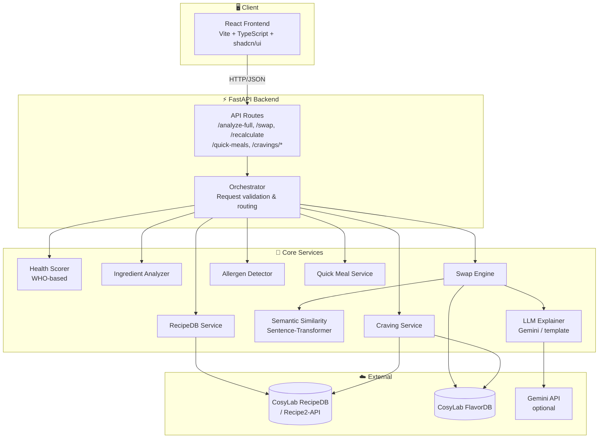

# NutriTwin Backend Architecture

**Production-ready CosyLab-first food intelligence engine**

---

## 0. High-Level Architecture

### 0.1 System Overview Diagram

The system is a **full-stack recipe health analysis and ingredient swap** application: a React/Vite frontend talks to a FastAPI backend, which orchestrates CosyLab APIs (RecipeDB, FlavorDB), local rule-based engines, and optional LLM (Gemini) for explanations and swap suggestions.



**ASCII view (no Mermaid):**

```
  [React Frontend]  ----HTTP---->  [FastAPI: /analyze-full, /recalculate, /cravings, /quick-meals]
                                            |
                    +-----------------------+-----------------------+
                    |                       |                       |
              [RecipeDB Svc]         [Health Scorer]         [Ingredient Analyzer]
                    |                       |                       |
                    v                       v                       v
              [CosyLab APIs]           (WHO score)            (risky list)
                    |                       |                       |
                    +-----------------------+-----------------------+
                                            |
                                    [Swap Engine] ----> [FlavorDB] (fallback: HEALTHY_SWAPS)
                                            |
                            +---------------+---------------+
                            |               |               |
                    [Semantic Rerank]  [LLM Explainer]  [Projected Score]
                    (all-MiniLM-L6-v2) (Gemini/template)
                                            |
                                            v
                              [FullAnalysisResponse: score, swaps, explanation]
```

### 0.2 How It Works So Far

| Layer | What it does |
|-------|----------------|
| **Frontend** | React app (Vite, TypeScript, shadcn-ui). User enters recipe name (and optionally ingredients/allergens/avoid list), triggers **full analysis** or **quick meals** or **craving replacement**. Displays health score, risky ingredients, swap suggestions with alternatives, and recalculates when user accepts/rejects swaps. |
| **API (FastAPI)** | Single entry point for analysis: **POST /analyze-full**. Optional **POST /recalculate** with accepted swaps; **POST /quick-meals** for filtered quick recipes; **POST /cravings/replace** and **POST /cravings/patterns** for craving flow. **GET /health** reports CosyLab API status. |
| **Orchestration** | For each analyze-full request: (1) resolve recipe + ingredients (RecipeDB lookup or user-provided), (2) fetch or estimate nutrition, (3) compute WHO-based health score, (4) detect allergens and avoid list, (5) find risky ingredients, (6) generate swaps (LLM agent if enabled, else rule-based + FlavorDB fallback), (7) re-rank with sentence-transformers, (8) project improved score and build explanation. |
| **Data sources** | **RecipeDB / Recipe2-API**: recipe search by title, multi-query ingredient fetch (3–8 ingredients per recipe due to API limit), nutrition (calories, protein, fat; missing fields supplemented from ingredient estimates). **FlavorDB**: flavor profiles and pairings (currently 404; swap engine falls back to HEALTHY_SWAPS dictionary). **Gemini**: optional explanations and LLM swap agent. |
| **Scoring & swaps** | **Health Scorer**: WHO-aligned model (macro balance, penalties for sugar/sodium/sat fat/processed, bonuses for fiber/whole grain/plant diversity). **Ingredient Analyzer**: keyword + nutrition thresholds → risky list with priority. **Swap Engine**: candidates from HEALTHY_SWAPS (and FlavorDB when up); ranking = flavor + health + semantic; **Semantic Similarity** (all-MiniLM-L6-v2) re-ranks locally. |
| **Output** | **FullAnalysisResponse**: ingredients, original/improved health score, risky ingredients, swap suggestions (each with top alternative + full alternatives list), score improvement, explanation (LLM or template), and optional similar recipe. |

**Current status:** Core path works: recipe → ingredients (limited by Recipe2-API) → health score → risky detection → rule-based swaps + semantic re-rank → projected score and explanation. FlavorDB is down (404), so flavor match and shared molecules are empty; micronutrient scoring is disabled due to missing vitamin/mineral data from the API.

### 0.3 RecipeDB and FlavorDB Endpoints Used

All URLs are relative to the base URLs in config (see `app/config.py`). Auth: `x-api-key` header (or Bearer when `RECIPEDB_USE_BEARER_AUTH` is set) for CosyLab.

#### RecipeDB (legacy search_recipedb)

**Base URL:** `RECIPEDB_BASE_URL` (default `https://cosylab.iiitd.edu.in/recipedb/search_recipedb`).  
Full path = `{base_url}/{endpoint}` (e.g. `.../search_recipedb/recipe_by_title`).

| Endpoint | Used for |
|----------|----------|
| `recipe_by_title` | Search recipe by name (fallback when Recipe2-API used for lookup). Params: `title`, `page`, `limit`. |
| `recipesinfo` (or `recipes`) | List recipes (org API). Params: `page`, `limit`. Used when matching by title across pages. |
| `recipe_nutrition_info` | Nutrition for a recipe (calories, protein, fat, etc.). Params: `id` (recipe id). |
| `recipe_micro_nutrition_info` | Vitamins/minerals for a recipe. Params: `id`. |
| `recipe_by_id` | Get full recipe by ID. Params: `id`. Used by `/swap`, recommendations, quick meals. |
| `recipe_by_calories` | Search by calorie range. Params: `min_calories`, `max_calories`. |
| `recipe_by_protein_range` | Search by protein range. Params: `min_protein`, `max_protein`. |
| `recipe_by_cuisine` | Search by cuisine. Params: `cuisine`. (LLM agent tool + recommendations.) |
| `recipe_by_diet` | Search by diet type. Params: `diet_type`. |
| `recipe_by_utensils` | Search by utensils. Params: `utensils`. |
| `recipe_by_recipes_method` | Search by cooking method. Params: `method`. |
| `recipe_by_category` | Search by category. Params: `category`. |
| `recipe_by_recipe_day_category` | Search by day category. Params: `day_category`. |
| `recipe_by_carbs` | Search by carb range. Params: `min_carbs`, `max_carbs`. |

#### Recipe2-API (separate base)

**Base URL:** `RECIPE2_API_BASE_URL` (default `https://cosylab.iiitd.edu.in/recipe2-api`).

| Path | Used for |
|------|----------|
| `GET /recipebyingredient/by-ingredients-categories-title` | Primary recipe search by title; multi-query used to collect 3–8 ingredients per recipe. Params: `title`, `page`, `limit` (max 10). |

#### FlavorDB

**Base URL:** `FLAVORDB_BASE_URL` (default `https://cosylab.iiitd.edu.in/flavordb`).  
Full path = `{base_url}/{endpoint}`.

| Endpoint | Used for |
|----------|----------|
| `entities_by_readable_name` | Flavor profile for an ingredient (molecules, etc.). Params: `name`. Also used for health-check probe (`name=water`). |
| `flavor_pairings` | Complementary ingredients for swap candidates. Params: ingredient name. |
| `molecules_by_flavor_profile` | Molecules for a flavor profile string (used in similarity). |
| `molecules_by_common_name` | Molecule details by common name. Used for explanations and LLM agent. |

#### FlavorDB Extended (LLM swap agent only)

Same base URL as FlavorDB. Used only when the Gemini LLM swap agent is enabled.

| Endpoint | Used for |
|----------|----------|
| `molecules_by_functional_group` | Molecules by functional group (e.g. aldehyde, ester). Params: `group`. |
| `molecules_by_weight_range` | Molecules by molecular weight range. Params: `min`, `max`. |
| `molecules_by_polar_surface_area` | Molecules by PSA range. Params: `min`, `max`. |
| `molecules_by_hbd_hba` | Molecules by H-bond donor/acceptor counts. Params: `min_hbd`, `max_hbd`, `min_hba`, `max_hba`. |
| `properties_by_aroma_threshold` | Aroma threshold for a molecule. Params: `name`. |
| `properties_by_taste_threshold` | Taste threshold for a molecule. Params: `name`. |
| `properties_natural_occurrence` | Natural food sources for a molecule. Params: `name`. |
| `physicochemical_properties` | ALogP, rings, bonds, atoms, etc. Params: `name`. |
| `regulatory_info` | FEMA/JECFA/COE/GRAS. Params: `name`. |

---

## 1. Architecture Overview

```
┌─────────────────────────────────────────────────────────────────────────────────┐
│                              CLIENT REQUEST                                       │
│                    (recipe_name, ingredients?, allergens?, avoid?)                 │
└─────────────────────────────────────────────────────────────────────────────────┘
                                        │
                                        ▼
┌─────────────────────────────────────────────────────────────────────────────────┐
│                         FALLBACK ROUTER (Orchestrator)                            │
│                                                                                   │
│   ┌─────────────────────┐     Success      ┌─────────────────────────────────┐   │
│   │ Try CosyLab APIs    │ ───────────────► │ CosyLab Pipeline (Primary)      │   │
│   │ (RecipeDB+FlavorDB) │                  │ - Health Score (WHO)             │   │
│   └─────────┬───────────┘                  │ - Risky Detection                │   │
│             │                              │ - Swap Generation (FlavorDB)     │   │
│             │ Failure                      │ - Sentence-Transformer Rerank    │   │
│             │ (timeout/503/empty/rate)     └─────────────────────────────────┘   │
│             ▼                                                                     │
│   ┌─────────────────────┐                                                         │
│   │ LLM Fallback        │                                                         │
│   │ - Heuristic nutrit  │                                                         │
│   │ - Risky inference    │                                                         │
│   │ - Swap proposals    │                                                         │
│   │ - ST re-rank still  │                                                         │
│   └─────────────────────┘                                                         │
└─────────────────────────────────────────────────────────────────────────────────┘
                                        │
                                        ▼
┌─────────────────────────────────────────────────────────────────────────────────┐
│                              OUTPUT                                               │
│   Health Profile │ Potential Profile │ Swap Suggestions │ Explanation             │
└─────────────────────────────────────────────────────────────────────────────────┘

┌─────────────────────────────────────────────────────────────────────────────────┐
│                     COMPONENT RESPONSIBILITY MATRIX                               │
├──────────────────┬──────────────────────────────────────────────────────────────┤
│ CosyLab RecipeDB │ Nutrition, ingredients, recipes, search                       │
│ CosyLab FlavorDB │ Flavor profiles, flavor similarity, entity relationships      │
│ Rule Engine      │ WHO scoring, penalties/bonuses, swap filtering, aggregation   │
│ Sentence-Transf. │ Semantic re-ranking ONLY; NO API calls; local cosine similarity│
│ LLM (Gemini)     │ ONLY on CosyLab failure; heuristic nutrition, swaps, explain  │
└──────────────────┴──────────────────────────────────────────────────────────────┘
```

---

## 2. WHO-Based Health Scoring Model

### 2.1 WHO Reference Values (per day, adult)

| Nutrient | WHO Limit | Per 2000 kcal | Per Serving (N servings/day) |
|----------|-----------|---------------|------------------------------|
| Free sugars | < 10% energy | < 50 g | < 50/N g |
| Saturated fat | < 10% energy | < 22 g | < 22/N g |
| Trans fat | < 1% energy | < 2.2 g | < 2.2/N g |
| Sodium | < 5 g salt | < 2 g Na | < 2/N g |
| Fiber | ≥ 25 g | ≥ 25 g | ≥ 25/N g |
| Protein | 10–15% energy | 50–75 g | 50/N – 75/N g |

*Energy: 2000 kcal reference. Serving-based: divide by N where N = expected servings from recipe.*

### 2.2 Mathematical Scoring Model

```
BASE_SCORE = 100

MACRO_PENALTIES (each 0–20, max 60):
  sugar_penalty    = min(20, max(0, (sugar_g - sugar_limit) / sugar_limit * 20))
  sat_fat_penalty  = min(20, max(0, (sat_fat_g - sat_limit) / sat_limit * 20))
  trans_fat_penalty= min(20, max(0, trans_fat_g * 10))  # any trans is bad
  sodium_penalty   = min(20, max(0, (sodium_mg/1000 - sodium_limit_g) / sodium_limit_g * 20))

FIBER_BONUS (0–15):
  fiber_bonus = min(15, (fiber_g / fiber_target) * 15)   # cap at 15

WHO_COMPLIANCE_BONUS (0–10):
  whole_grain_bonus = has_whole_grain ? 5 : 0
  plant_diversity   = min(5, unique_plant_categories * 1.5)  # fruits, veg, legume, nut

PROCESSED_PENALTY (0–25):
  ultra_processed_count = count(ingredients in ULTRA_PROCESSED_SET)
  processed_penalty = min(25, ultra_processed_count * 5)

HEALTH_SCORE = BASE_SCORE
             - sugar_penalty
             - sat_fat_penalty
             - trans_fat_penalty
             - sodium_penalty
             - processed_penalty
             + fiber_bonus
             + whole_grain_bonus
             + plant_diversity

FINAL_SCORE = clip(HEALTH_SCORE, 0, 100)
```

### 2.3 Per-Serving Normalization

For a recipe yielding N servings:
```
sugar_limit_per_serving   = 50 / N
sat_fat_limit_per_serving = 22 / N
trans_fat_limit_per_serving = 2.2 / N
sodium_limit_per_serving  = 2 / N   (g Na)
fiber_target_per_serving  = 25 / N
```

### 2.4 Risky Ingredient Detection Rules

```python
RISKY_CATEGORIES = {
    "ultra_processed": ["modified starch", "hydrogenated", "high fructose", "maltodextrin", ...],
    "refined_sugar": ["white sugar", "brown sugar", "corn syrup", "dextrose", ...],
    "high_sodium": ["salt", "soy sauce", "msg", "sodium benzoate", ...],
    "high_sat_fat": ["butter", "lard", "palm oil", "cream", ...],
    "trans_fat": ["shortening", "margarine", "hydrogenated oil", ...],
    "artificial": ["aspartame", "sucralose", "red 40", "bha", "bht", ...],
}

def is_risky(ingredient, nutrition_per_serving):
    keyword_match = any(kw in ingredient for cat, kws in RISKY_CATEGORIES for kw in kws)
    nutrition_match = (
        nutrition_per_serving["sugar"] > 15 or
        nutrition_per_serving["sodium"] > 0.4 or  # 400mg
        nutrition_per_serving["saturated_fat"] > 5 or
        nutrition_per_serving["trans_fat"] > 0.1
    )
    return keyword_match or nutrition_match
```

---

## 3. Health Profile + Potential Profile

### 3.1 Health Profile (Current State)

```json
{
  "schema_version": "1.0",
  "health_profile": {
    "overall_score": 68,
    "diet_category": "High_Carb",
    "balance_score": 0.72,
    "nutritional_density": 0.65,
    "risk_flags": ["high_sugar", "low_fiber"],
    "strengths": ["adequate_protein", "low_trans_fat"],
    "weaknesses": ["excess_sugar", "fiber_deficiency"],
    "breakdown": {
      "macros": {
        "carb_pct": 55,
        "protein_pct": 18,
        "fat_pct": 27,
        "sugar_pct_of_energy": 14,
        "sat_fat_pct_of_energy": 8
      },
      "penalties": {
        "sugar": 8,
        "saturated_fat": 0,
        "trans_fat": 0,
        "sodium": 4,
        "processed": 5
      },
      "bonuses": {
        "fiber": 6,
        "whole_grain": 0,
        "plant_diversity": 3
      }
    },
    "risky_ingredients": [
      {"name": "white sugar", "reason": "refined_sugar", "priority": 4}
    ]
  }
}
```

### 3.2 Potential Profile (Achievable Best)

```
POTENTIAL_SCORE = theoretical best if all risky ingredients swapped optimally

For each risky ingredient R:
  candidates = FlavorDB.get_similar(R) ∩ WHO_compliant_filter
  best_swap = argmax(0.5*flavor + 0.4*health + 0.1*semantic) over candidates
  projected_nutrition += nutrition_delta(R → best_swap)

POTENTIAL_SCORE = WHO_score(projected_nutrition)
IMPROVEMENT_HEADROOM = (POTENTIAL_SCORE - CURRENT_SCORE) / (100 - CURRENT_SCORE) * 100
```

```json
{
  "potential_profile": {
    "theoretical_best_score": 82,
    "improvement_headroom_pct": 43.75,
    "primary_limiting_factors": ["white sugar", "refined flour"],
    "blockers": [
      {"ingredient": "white sugar", "reason": "excess_free_sugar", "max_improvement": 8}
    ],
    "projected_breakdown": { ... }
  }
}
```

---

## 4. Swap Generation (Rule-Based + FlavorDB Hybrid)

### 4.1 Current Implementation Flow

```
1. Identify unhealthy ingredient (Rule Engine via UNHEALTHY_KEYWORDS)
   - Keyword matching: high_fat, high_sodium, high_sugar, additive, etc.
   - Nutrition-based: saturated_fat > 10g triggers fat source detection
   - Priority assignment: 1-5 (5=highest risk)

2. Normalize ingredient name (remove quantities, measurements, prep words)
   "3 tablespoons butter , divided" → "butter"

3. Candidate Discovery (Multi-Source):
   a) HEALTHY_SWAPS dictionary (primary, always available)
      - Exact key match: "butter" → ["olive oil", "ghee", "avocado"]
      - Partial substring match: "heavy cream" matches "cream"
      - Category fallback: all "high_fat" → all oil alternatives
   
   b) FlavorDB flavor pairings (molecule-aware, fallback when API available)
      - get_flavor_pairings(ingredient) → complementary ingredients
      - Currently returns empty (API down), graceful fallback
   
   c) Filter out ingredients already in recipe

4. Ranking (top 5 returned):
   rank_score = (flavor_match × 0.5) + (health_improvement × 0.4) + (semantic_similarity × 0.1)
   
   Where:
   - flavor_match: FlavorDB Jaccard similarity (0% when API down)
   - health_improvement: Estimated from category upgrade (e.g., butter→olive oil = 40%)
   - semantic_similarity: Sentence-transformer cosine (all-MiniLM-L6-v2)

5. Extract shared flavor molecules for explainability
   - FlavorDB get_flavor_profile() for both original and candidate
   - Jaccard intersection of molecule sets
   - Returns top 8 shared molecules (empty when FlavorDB down)

6. Return top-5 alternatives with explanations
```

### 4.1.5 Recipe2-API Multi-Query Ingredient Fetching

**Challenge**: Recipe2-API returns ONE ingredient row per recipe per search result
- Each search: `GET /by-ingredients-categories-title?title={query}&page=1&limit=10`
- Returns 10 different recipes (1 ingredient each), not 10 ingredients for 1 recipe

**Solution**: Multi-query strategy using title word permutations
```python
def _fetch_all_ingredients_for_recipe(recipe_id, recipe_title):
    words = recipe_title.split()
    search_terms = set()
    
    # 1. Individual words (skip generic/short)
    search_terms.update([w for w in words if len(w) > 3])
    
    # 2. Word pairs (2-grams)
    for i in range(len(words) - 1):
        search_terms.add(f"{words[i]} {words[i+1]}")
    
    # Cap at 12 searches to prevent timeout
    search_terms = list(search_terms)[:12]
    
    # Execute searches and collect matching rows
    for term in search_terms:
        results = recipe2_api_search(title=term, page=1)
        matched_rows = [r for r in results if r['Recipe_id'] == recipe_id]
        # Collect unique ingredient_Phrase values
```

**Result**: Typically collects 3-8 ingredients per recipe (vs 1 with single query)

### 4.2 Swap Rules & Constraints

| Rule | Implementation |
|------|----------------|
| Category preservation | Same functional type (oil→oil, sweetener→sweetener, etc.) |
| Recipe context | Filters out ingredients already in recipe to avoid duplication |
| Health improvement | Estimates based on category upgrades (e.g., refined→whole grain = +30%) |
| Ingredient normalization | Extracts core name: "2 cups chopped tomatoes" → "tomatoes" |
| FlavorDB fallback | Gracefully degrades to HEALTHY_SWAPS when FlavorDB API unavailable |

### 4.3 Projected Nutrition Calculation

**Challenge**: API provides limited nutrition data; swapping one ingredient shouldn't zero out nutrients

**Solution**: Baseline injection + proportional adjustment
```python
BASELINE = {
    "sugar": 5.0,         # Prevents zero-multiply
    "sodium": 50.0,      # Realistic minimum
    "saturated_fat": 2.0,
    "trans_fat": 0.0,
    "cholesterol": 20.0,
    "fiber": 2.0
}

def estimate_nutrition_with_swaps(original_nutrition, swaps, total_ingredients):
    new_nutrition = original_nutrition.copy()
    share = 1 / max(3, total_ingredients)  # Floor at 3 to prevent over-adjustment
    
    for swap in swaps:
        delta_pct = SWAP_HEALTH_DELTA[swap_category]  # e.g., "oil" → 40% sat_fat reduction
        
        for nutrient in ADJUSTABLE_NUTRIENTS:
            baseline_val = BASELINE.get(nutrient, 0)
            current = new_nutrition.get(nutrient, baseline_val) or baseline_val
            
            adjustment = current * share * (delta_pct / 100.0)
            new_nutrition[nutrient] = max(0, current - adjustment)
    
    return new_nutrition
```

### 4.4 Swap Output Schema (Enhanced)

### 4.4 Swap Output Schema (Enhanced)

```json
{
  "original": "3 tablespoons butter , divided",
  "substitute": {
    "name": "olive oil",
    "flavor_match": 0.0,        // 0-100%, FlavorDB Jaccard similarity (0 when API down)
    "health_improvement": 40.0,  // 0-100%, estimated from category upgrade
    "category": "oil",
    "rank_score": 0.4,          // (flavor×0.5 + health×0.4 + semantic×0.1)
    "explanation": "Olive oil provides heart-healthy monounsaturated fats...",
    "shared_molecules": []      // FlavorDB molecules (empty when API down)
  },
  "alternatives": [             // Top 5 ranked alternatives for frontend selection
    {
      "name": "olive oil",
      "flavor_match": 0.0,
      "health_improvement": 40.0,
      "shared_molecules": []
    },
    {
      "name": "ghee",
      "flavor_match": 0.0,
      "health_improvement": 30.0,
      "shared_molecules": []
    },
    {
      "name": "avocado",
      "flavor_match": 0.0,
      "health_improvement": 45.0,
      "shared_molecules": []
    }
  ],
  "accepted": true             // Frontend can toggle acceptance
}
```

### 4.5 Current System Status & Known Limitations

**✅ Working Features:**
- Rule-based swap generation via HEALTHY_SWAPS (130+ ingredient entries)
- Multi-query Recipe2-API ingredient fetching (3-8 ingredients per recipe)
- Health scoring with WHO-based penalties and bonuses
- Risky ingredient detection (keyword + nutrition-based)
- Projected nutrition calculation with baseline injection
- Multiple alternatives per swap for user selection
- LLM explanation generation (Gemini) with template fallback

**⚠️ Known Limitations:**
1. **FlavorDB API Currently Unavailable**
   - All endpoints (`entities_by_readable_name`, `flavor_pairings`, etc.) return 404
   - System gracefully falls back to HEALTHY_SWAPS dictionary
   - `flavor_match` = 0%, `shared_molecules` = [] in all responses
   - Impact: No molecule-aware flavor discovery, no scientific explainability

2. **Recipe2-API Single-Ingredient-Per-Search Limitation**
   - API design: Returns 1 ingredient row per recipe per search result
   - Multi-query mitigation collects 3-8 ingredients (vs complete recipe ~15-20)
   - Different ingredients surface on each request (random sampling)
   - Consequence: Incomplete ingredient lists, variable swap suggestions

3. **Limited Nutrition Data from API**
   - Available: Calories, Energy (kcal), Protein (g), Total lipid (fat) (g)
   - Missing: Carbs, Sodium, Cholesterol, Vitamins, Minerals
   - Estimated: saturated_fat = 50% of total fat
   - Baseline injection prevents zero-multiply errors

4. **Micronutrient Scoring Disabled**
   - Current score: macro (0-40) + negative penalties (0 to -30)
   - Micro component (0-30) always = 0 due to missing vitamin/mineral data
   - Score range effectively: 0-70 instead of 0-100

**🔄 Fallback Behavior:**
- FlavorDB failure → HEALTHY_SWAPS dictionary
- Recipe2-API failure → Return error (no LLM generation yet)
- Nutrition data missing → Baseline values + estimation
- LLM unavailable → Template-based explanations

---

## 5. Strict Fallback Logic

### 5.1 CosyLab Failure Detection

```python
def is_cosylab_failure(response_or_exception):
    if response_or_exception is None:
        return True
    if isinstance(response_or_exception, TimeoutError):
        return True
    if isinstance(response_or_exception, requests.HTTPError):
        return response_or_exception.response.status_code in (401, 403, 429, 500, 502, 503)
    if response is dict/list and (empty or "error" in response):
        return True
    return False
```

### 5.2 Fallback Router Pseudocode

```python
def analyze_recipe(request):
    cosylab_ok = False
    try:
        # 1. Try RecipeDB
        recipe = recipedb.fetch_recipe(request.recipe_name)
        if not recipe or not recipe.get("ingredients"):
            raise CosyLabUnavailable("RecipeDB empty")

        nutrition = recipedb.fetch_nutrition(recipe["id"])
        micro = recipedb.fetch_micro_nutrition(recipe["id"])
        if not nutrition:
            raise CosyLabUnavailable("Nutrition empty")

        # 2. Try FlavorDB for each risky ingredient
        risky = identify_risky(recipe["ingredients"], nutrition)
        swap_candidates = {}
        for r in risky:
            fp = flavordb.get_flavor_profile(r.name)
            if fp:
                swap_candidates[r] = flavordb.get_similar_entities(fp)

        cosylab_ok = True

    except (Timeout, requests.RequestException, CosyLabUnavailable) as e:
        log.warning("CosyLab failed: %s", e)
        cosylab_ok = False

    if cosylab_ok:
        # PRIMARY: CosyLab pipeline
        health_score = who_score(nutrition, micro, recipe["ingredients"])
        health_profile = build_health_profile(health_score, nutrition, risky)
        swaps = generate_swaps_cosylab(risky, flavordb, recipedb)
        swaps = sentence_transformer_rerank(swaps)  # ALWAYS runs
        potential = compute_potential(recipe, swaps, health_score)
    else:
        # FALLBACK: LLM only
        nutrition = llm_estimate_nutrition(recipe_name, ingredients)
        risky = llm_identify_risky(ingredients)
        swaps = llm_propose_swaps(risky, ingredients)
        swaps = sentence_transformer_rerank(swaps)  # ST still active
        health_score = who_score(nutrition, ...)  # Use heuristic nutrition
        health_profile = build_health_profile(...)
        potential = compute_potential(...)

    return {
        "health_profile": health_profile,
        "potential_profile": potential,
        "swap_suggestions": swaps,
    }
```

### 5.3 LLM Must NOT Run in Parallel

```
WRONG:  if USE_LLM: llm_run() else cosylab_run()
RIGHT:  try cosylab_run() except: llm_run()
```

---

## 6. Sentence-Transformer Contract

```python
# MUST:
# - Run locally only
# - NOT call CosyLab
# - NOT replace CosyLab for swap discovery
# - ONLY re-rank existing candidates

def semantic_rerank(original: str, candidates: List[Dict]) -> List[Dict]:
    """
    candidates: [{"name": "olive oil", "flavor_match": 70, "health_improvement": 8}, ...]
    Returns: same list, re-sorted by rank = 0.5*flavor + 0.4*health + 0.1*semantic
    """
    texts = [original] + [c["name"] for c in candidates]
    embs = model.encode(texts)
    orig_emb = embs[0]
    cand_embs = embs[1:]
    semantic_scores = [cosine_sim(orig_emb, e) * 50 + 50 for e in cand_embs]  # 0-100
    for c, s in zip(candidates, semantic_scores):
        c["semantic_score"] = s
        c["rank"] = 0.5*c["flavor_match"] + 0.4*c["health_improvement"] + 0.1*s
    return sorted(candidates, key=lambda x: x["rank"], reverse=True)
```

---

## 7. Database Structure (If Needed)

```sql
-- Recipe cache (reduce CosyLab calls)
CREATE TABLE recipe_cache (
    id UUID PRIMARY KEY,
    recipe_name VARCHAR(255) UNIQUE NOT NULL,
    cosylab_recipe_id VARCHAR(64),
    ingredients JSONB,
    nutrition JSONB,
    micro_nutrition JSONB,
    fetched_at TIMESTAMPTZ,
    expires_at TIMESTAMPTZ
);

-- Analysis results (audit / ML)
CREATE TABLE analysis_log (
    id UUID PRIMARY KEY,
    recipe_name VARCHAR(255),
    source VARCHAR(16),  -- 'cosylab' | 'llm_fallback'
    health_score FLOAT,
    health_profile JSONB,
    potential_profile JSONB,
    swap_suggestions JSONB,
    created_at TIMESTAMPTZ
);

-- API availability tracking
CREATE TABLE api_health (
    id UUID PRIMARY KEY,
    api_name VARCHAR(32),  -- 'recipedb' | 'flavordb'
    status VARCHAR(16),   -- 'ok' | 'fail'
    response_time_ms INT,
    error_message TEXT,
    checked_at TIMESTAMPTZ
);
```

---

## 8. JSON Schema Summary

### Health Score Response

```json
{
  "overall_score": "number 0-100",
  "rating": "Excellent|Good|Decent|Bad|Poor",
  "breakdown": {
    "base": 100,
    "penalties": { "sugar": 0, "sat_fat": 0, "trans_fat": 0, "sodium": 0, "processed": 0 },
    "bonuses": { "fiber": 0, "whole_grain": 0, "plant_diversity": 0 }
  }
}
```

### Full Analysis Response

```json
{
  "source": "cosylab|llm_fallback",
  "health_profile": { ... },
  "potential_profile": { ... },
  "swap_suggestions": [
    {
      "original": "string",
      "replacement": "string",
      "health_delta": "number",
      "flavor_delta": "number",
      "semantic_score": "number 0-100",
      "explanation": "string"
    }
  ]
}
```

---

## 9. Summary: Component Responsibilities (Updated)

| Component | Responsibility| Data Source | Status |
|-----------|----------------|-------------|--------|
| **RecipeDB Service** | Recipe metadata (legacy endpoints - mostly 404) | CosyLab RecipeDB | ⚠️ Disabled |
| **Recipe2-API Service** | Recipe search by title, ingredient fetching | CosyLab Recipe2-API | ✅ Working |
| **FlavorDB Service** | Flavor profiles, molecule similarity, pairings | CosyLab FlavorDB | ❌ API Down (404) |
| **Health Scorer** | WHO-based scoring, macro balance, penalties | Local calculation | ✅ Working |
| **Ingredient Analyzer** | Risky detection via keywords + nutrition thresholds | UNHEALTHY_KEYWORDS dict | ✅ Working |
| **Swap Engine** | Multi-source swap generation, ranking | HEALTHY_SWAPS + FlavorDB (fallback) | ✅ Working (degraded) |
| **Sentence Transformer** | Semantic re-ranking of swap candidates | all-MiniLM-L6-v2 (local) | ✅ Working |
| **LLM Explainer** | Swap explanations with molecule evidence | Gemini API (optional) | ✅ Working |
| **Craving Service** | Mood-based recipe recommendations | RecipeDB + FlavorDB | ⚠️ Partial (FlavorDB down) |

### Data Flow Architecture (As-Implemented)

```
┌─────────────────────────────────────────────────────────────────┐
│                     POST /analyze-full                            │
│                  {"recipe_name": "Butter Chicken"}                │
└─────────────────────────────┬───────────────────────────────────┘
                              │
                              ▼
┌─────────────────────────────────────────────────────────────────┐
│           Recipe2-API Multi-Query Ingredient Fetch                │
│  - Search with title + word combinations (max 12 queries)        │
│  - Collect 3-8 ingredients (API limitation: 1 per search)        │
│  - Extract nutrition: calories, protein, fat (limited set)       │
└─────────────────────────────┬───────────────────────────────────┘
                              │
                              ▼
┌─────────────────────────────────────────────────────────────────┐
│               Health Score Calculation (WHO Model)                │
│  - Macro balance: protein/carbs/fat% vs targets (0-40 pts)       │
│  - Micro adequacy: DISABLED - no vitamin data (0 pts always)     │
│  - Negative penalties: sodium/sugar/sat_fat thresholds (0 to -30)|
│  → Score: 0-100 (effectively 0-70 without micro)                  │
└─────────────────────────────┬───────────────────────────────────┘
                              │
                              ▼
┌─────────────────────────────────────────────────────────────────┐
│        Risky Ingredient Detection (IngredientAnalyzer)            │
│  1. Keyword matching: UNHEALTHY_KEYWORDS (high_fat, high_sodium) │
│  2. Nutrition threshold: saturated_fat > 10g                      │
│  3. Priority assignment: 1-5 (risk weight × impact)               │
│  → RiskyIngredient[] with name, category, reason, priority       │
└─────────────────────────────┬───────────────────────────────────┘
                              │
                              ▼
┌─────────────────────────────────────────────────────────────────┐
│            Swap Generation (SwapEngine + FlavorDB Fallback)       │
│  For each risky ingredient:                                       │
│    1. Normalize name: "3 tbsp butter" → "butter"                 │
│    2. Get candidates:                                             │
│       • HEALTHY_SWAPS[category][ingredient]                      │
│       • FlavorDB.get_flavor_pairings() → FALLBACK (404)          │
│    3. Rank by: flavor(0%)+health(40%)+semantic(10%) = 0.4        │
│    4. Extract shared molecules → EMPTY (FlavorDB down)            │
│    5. Return top-5 alternatives                                   │
└─────────────────────────────┬───────────────────────────────────┘
                              │
                              ▼
┌─────────────────────────────────────────────────────────────────┐
│          Projected Nutrition & Score (with swaps applied)         │
│  - Baseline injection: sugar=5g, sodium=50mg, sat_fat=2g         │
│  - Share = 1/max(3, total_ingredients)                            │
│  - Adjust ONLY: sugar, sodium, sat_fat, trans_fat, cholesterol   │
│  - Recalculate health score → improvement: +5 to +15 points      │
└─────────────────────────────┬───────────────────────────────────┘
                              │
                              ▼
┌─────────────────────────────────────────────────────────────────┐
│            LLM Explanation (Gemini or Template Fallback)          │
│  - If GEMINI_API_KEY: Generate 3-4 sentence scientific explain   │
│  - Include: molecule evidence, score delta, category names        │
│  - Fallback: Template with placeholders                           │
└─────────────────────────────┬───────────────────────────────────┘
                              │
                              ▼
┌─────────────────────────────────────────────────────────────────┐
│                     FullAnalysisResponse                          │
│  {                                                                │
│    ingredients: ["butter", "cashews", "salt"],                    │
│    original_health_score: {score: 27.92, rating: "Bad"},          │
│    risky_ingredients: [{name: "butter", category: "high_fat"}],   │
│    swap_suggestions: [                                            │
│      {                                                            │
│        original: "butter",                                        │
│        substitute: {name: "olive oil", flavor_match: 0%},         │
│        alternatives: [{name:"olive oil"},{name:"ghee"},{...}]     │
│      }                                                            │
│    ],                                                             │
│    improved_health_score: {score: 37.92, rating: "Bad"},          │
│    score_improvement: 10.0                                        │
│  }                                                                │
└─────────────────────────────────────────────────────────────────┘
```

### System Health Status

**Production Readiness: ⚠️ PARTIALLY READY**

✅ **Core Functionality Working:**
- Recipe search and ingredient fetching (limited to 3-8 ingredients)
- Health scoring with WHO-based model
- Risky ingredient detection
- Swap generation with multiple alternatives
- Score projection and improvement calculation
- LLM explanations with graceful fallback

❌ **Blockers for Full Production:**
1. FlavorDB API unavailable (all endpoints 404)
2. Recipe2-API single-ingredient limitation (incomplete ingredient lists)
3. Missing micronutrient data (scoring disabled)
4. No vitamin/mineral/carb data from API

**Recommended Actions:**
1. Contact CosyLab support to verify FlavorDB endpoint status
2. Document Recipe2-API limitation to users ("Sample ingredients shown")
3. Consider fallback to manual ingredient entry for complete analysis
4. Implement client-side caching to reduce multi-query API load
